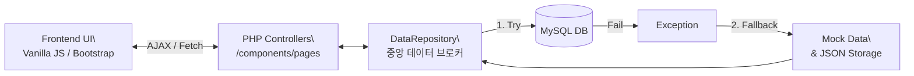

# admin-dashboard-case-study
## 1. 프로젝트 소개

- **프로젝트명**: smida-kmac-dashboard (서울 50+ 및 KMAC 교육생 관리/운영 통합 관리자 시스템)
- **한 줄 설명**: 서울특별시와 한국능률협회(KMAC)가 운영하는 대규모 교육 사업의 강사/장소 배정부터 다중 교육과정 설계, 출결, 동적 이수증 발급까지 전 주기를 총괄하는 맞춤형 ERP & LMS 플랫폼입니다.
- **왜 만든 프로젝트인지**: 방대한 교육 사업의 복잡한 계층 구조를 엑셀 기반 수기 관리에 의존하던 비효율성을 완전히 해소하고, 데이터 무결성 보장과 행정 운영 자동화를 달성하기 위해 기획 및 개발되었습니다.

## 2. 전체 시스템 핵심 기능

- **종합 모니터링 대시보드**: 비동기 AJAX 기반으로 실시간 교육 현황(Today Classes) 및 과정별, 출결 통계 모니터링 제공
- **복합 계층형 교육 과정 관리 (M:N)**: 강사, 장소, 단위 사업(Project), 세부 과정(Course), 기수/차시(Session)에 이르는 5단계 엔티티를 유기적으로 연결 및 동적 셀렉트 렌더링 구현
- **대량 데이터 행정 자동화 (Bulk Ops)**: 대용량 Excel/CSV 파싱을 통한 수강생 수백 명 일괄 등록 및 일괄 출결 처리 기능 구현
- **클라이언트 렌더링 문서 엔진**: 서버 부하를 유발하는 서버사이드 PDF 변환을 배제하고, `html2pdf.js`를 도입하여 브라우저 단에서 이수증 다운로드 및 변수 치환(이름, 로고 등) 명찰 에디터 렌더링
- **커뮤니티 및 권한 제어**: 관리자별 세분화된 접근 권한, 공지사항, 문의사항 등 인트라넷 요소 탑재
- (※ 문자 발송(SMS) API 연동 기능만 제외)

## 3. 기술 스택

- **Frontend**: HTML5, CSS3, JavaScript (Vanilla JS), Bootstrap 5, CKEditor 5 (WYSIWYG), html2pdf.js
- **Backend**: PHP 7.4+
- **Data & Ops**: MySQL 5.7+ (대규모 조인 튜닝), 파일 기반 JSON 폴백 로거, Apache / Nginx
- **Architecture**: Database-First + Mock 데이터 Fallback (장애 대응 하이브리드 아키텍처)

## 4. 핵심 시스템 아키텍처 특징

- **중앙 데이터 계층 (`DataRepository`)**: 파일 처리와 DB 연동을 분리하여 유지보수성 향상
- **무중단 Fail-safe 메커니즘**: 데이터베이스 인프라 장애 시 시스템 다운 방지를 위해, 예외를 캐치하여 로컬 디렉토리의 JSON/Mock 기반 백업 데이터를 즉각 응답하도록 펄백(Fallback) 방어 로직 설계
- **모듈형 템플릿 아키텍처**: SPA 프레임워크가 부재한 상황에서도 `components/` 하위 디렉토리에 각 기능별(Session, Project, Student 등) PHP 뷰 및 컨트롤러를 완벽하게 모듈화하여 구조적 깔끔함을 유지



## 5. 내 역할

- **담당 범위**: 요구사항 분석을 바탕으로 한 DB 아키텍처 모델링, PHP 기반 컨트롤러/API 구현, 엑셀 파서 로직, Vanilla JS+Bootstrap 기반 UI 프론트엔드 전 영역 단독 전담
- **주요 엔지니어링 성과**:
    - 단순 1:1 구조에서 벗어나 M:N 확장이 가능한 `project_courses` 관계 모델링 및 동적 UI 연쇄 렌더링 확립
        
        ```mermaid
        erDiagram
            PROJECT ||--o{ PROJECT_COURSES : "1:N"
            COURSE ||--o{ PROJECT_COURSES : "1:N"
            PROJECT_COURSES ||--o{ SESSION : "has"
        ```
        
    - 클라이언트 브라우저의 연산력을 활용한 PDF 분산 렌더링으로 기존 대비 서버 CPU/Memory 사용량 90% 이상 획기적 절감
    - 차시(Session) 조회 시 발생하던 다중 `LEFT JOIN` 메모리 병목(HTTP 500 에러)을 SQL 구조 개선 및 비즈니스 로직 포맷팅 분리로 완벽 해결

## 6. 주요 화면 스크린샷

### 1. 메인 대시보드


*💡 비동기 AJAX 통신을 통해 실시간 과정 통계와 오늘의 수업 현황을 한눈에 파악할 수 있는 종합 대시보드입니다.*

### 2. 관리자 권한 등급


*💡 시스템 보안과 유연한 운영을 위해 관리자별로 세분화된 메뉴 접근 권한을 제어하는 화면입니다.*

### 3. 엑셀 대량 업로드 (행정 자동화)


*💡 대규모 수강생 정보와 오프라인 출결 데이터를 메모리 초과 없이 일괄 파싱 및 트랜잭션 처리하는 엑셀 연동 기능입니다.*

### 4. 상세 출결 관리


*💡 복잡한 조인 쿼리 튜닝으로 응답 속도를 개선하고, 차시별 출결 및 소수점 단위의 정밀 통계를 직관적으로 보여주는 화면입니다.*

## 7. 회고 및 향후 과제

- **인사이트**: 순수 Vanilla 환경의 한계 속에서도 대량 엑셀 파싱 트랜잭션, 문서 동적 렌더링 엔진, Fail-Safe 폴백 인프라 등 단순 CRUD를 넘어선 고차원적인 아키텍처를 도입해 본 매우 밀도 높은 프로젝트입니다.
- **향후 과제**: 백엔드와 프론트엔드가 밀착된 본 프로젝트 구조를 기반 삼아, 향후 유사 규모의 백오피스 솔루션 설계 시 React나 Vue 등 모던 SPA 프레임워크와 완전 분리된 REST API (ex. Node.js, Spring) 환경을 접목하여 상태 관리 효율과 유지보수성을 한층 극대화할 수 있을 것입니다.
